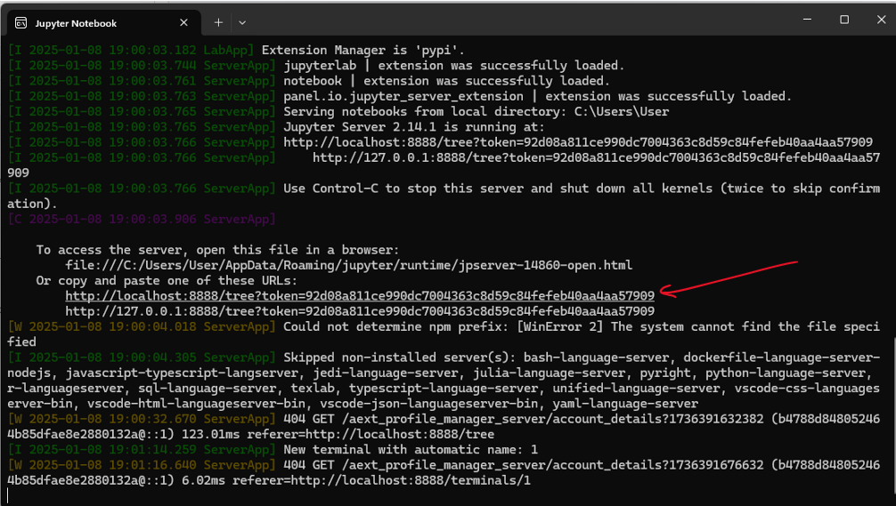
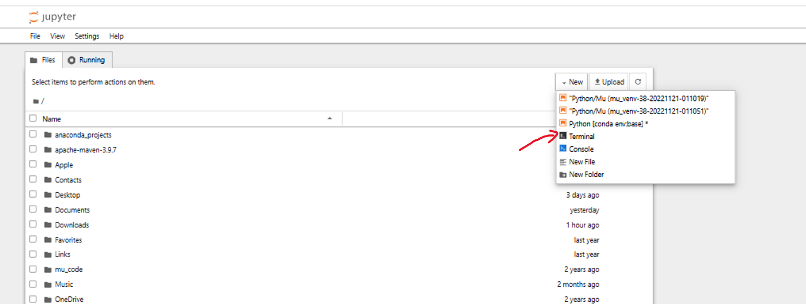

# Project Setup

## Initial Setup

**To-Do Date**: Jan 11 at 8:59 PM  
**Acknowledgement**: Ouldooz Baghban Karimi

This project uses [SQLite](https://en.wikipedia.org/wiki/SQLite) as the database management system (DBMS). Unlike other database management systems (e.g., Oracle, DB2, and SQL Server), SQLite is not a client–server database engine. Instead, it is embedded directly into the end program, making it suitable for billions of applications.

---

## Steps for Setup

### Step 1: Install Jupyter Notebook
Jupyter is an open-source web application that allows you to create and share documents containing live code, equations, visualizations, and narrative text.

- Install Jupyter Notebook using [Anaconda Python 3.12](https://www.anaconda.com/download/success). 
- Do not choose Miniconda unless you need a minimal installation and are prepared to install Jupyter Notebook manually.

### Step 2: Install SQLite
- **Mac OS X or Linux**: SQLite should be pre-installed. Verify by opening a terminal and typing:
  ```bash
  sqlite3
  ```
  To exit SQLite, type:
  ```bash
  .exit
  ```

- **Windows**: Follow the [SQLite installation guide for Windows](https://www.sqlitetutorial.net/download-install-sqlite/) and verify the installation.

### Step 3: Install JupySQL
[JupySQL](https://jupysql.ploomber.io/en/latest/quick-start.html) allows you to run SQL and plot large datasets in Jupyter using `%sql`, `%%sql`, and `%sqlplot` magics.

- To install JupySQL, open Anaconda Prompt and type:
  ```bash
  conda install jupysql -c conda-forge
  ```

### Step 4: Initial Test
1. Download the [test.ipynb](https://github.com/faa35/CMPT_354/blob/main/Module_1/test.ipynb) file.
2. Open Jupyter Notebook, 
3. after opening Jupyter Notebook:
   - Click on the Windows search bar and type "Jupyter Notebook."
   - Give it some time to load. It will open in your Adobe file (since that is the main file location).
   - Click on the local host link to open Jupyter Notebook in the default browser.
   
   - Find the file you want to run. If the file is not in the folder where Jupyter Notebook is installed, do the following:
   
     - Click on "New," open the terminal, and type:
       ```bash
       D:
       ```
       (Assuming the file you want to run is in the D: drive.)
     - Then type:
       ```bash
       jupyter notebook
       ```
     - This will start Jupyter Notebook in the D: folder. Browse through the interface to find the file. click on it then then choose `open`


4. load `test.ipynb`, and run each cell in order by pressing `Shift + Enter`.
5. Verify that you receive the [expected-output.pdf](https://github.com/faa35/CMPT_354/blob/main/Module_1/expected-output.pdf)

---

## Additional Notes
- Ensure all dependencies are properly installed before starting your assignment.
- Contact the project maintainer if you encounter any issues during setup.
